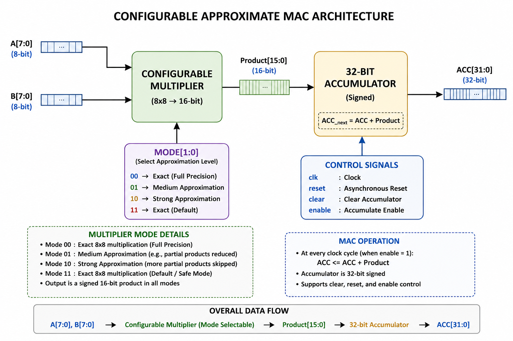
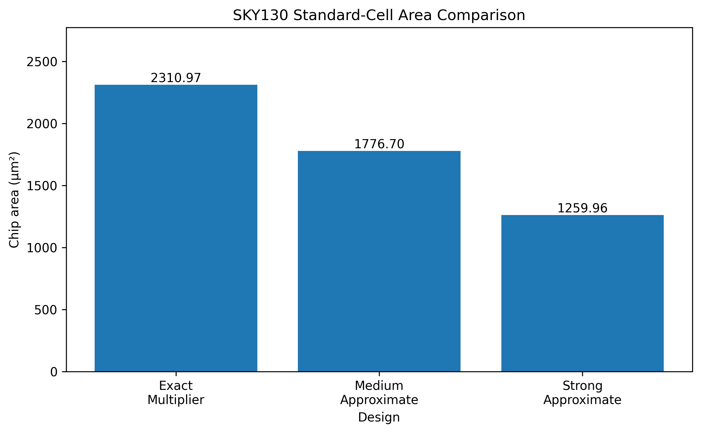
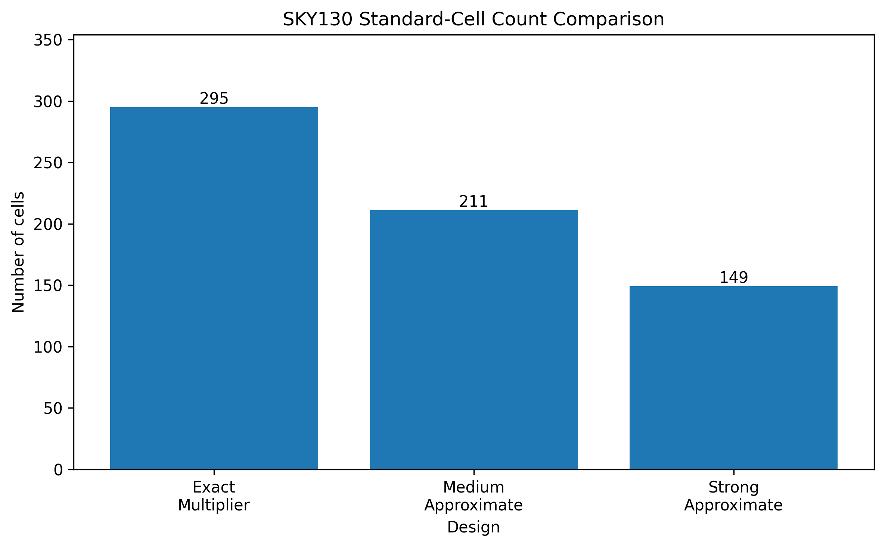
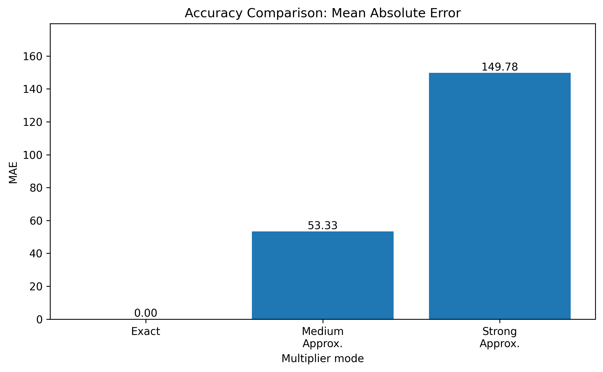
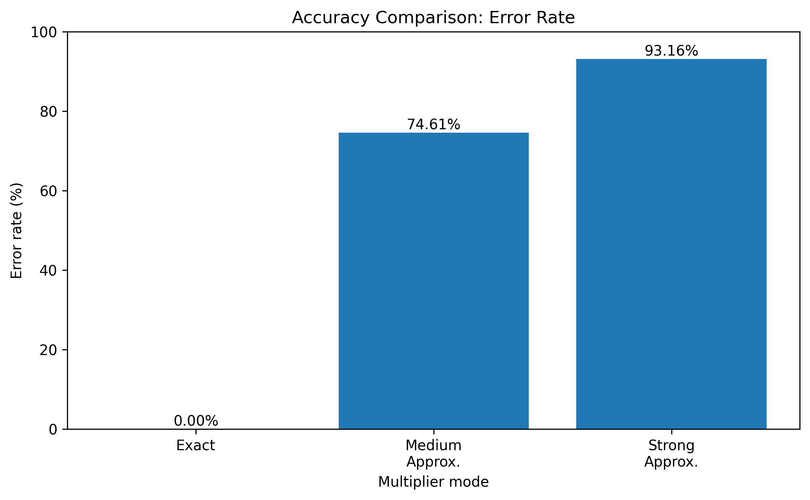

# Configurable Approximate Multiply-Accumulate (MAC)

## Overview

This project implements a configurable signed 8-bit Multiply-Accumulate (MAC) architecture with runtime-selectable exact and approximate multiplication modes.

The design explores the trade-off between **numerical accuracy and hardware cost**. It includes exact 8×8 multiplication, a medium architectural approximation based on operand precision reduction, a stronger approximation mode, a configurable multiplier, and a clocked configurable MAC.

The design was verified using exhaustive simulation and synthesized using the SKY130 standard-cell library.

---

## Key Features

- Signed INT8 × INT8 multiplication
- Exact multiplication mode
- Medium and strong approximation modes
- Runtime-selectable accuracy modes
- Signed INT32 accumulation
- Reset, clear, and enable controls
- Exhaustive functional verification
- SKY130 standard-cell technology mapping

---

## Architecture



### Operating Modes

| Mode | Operation |
| ---- | --------- |
| `00` | Exact multiplication |
| `01` | Medium approximation: discard 1 LSB from each operand before multiplication |
| `10` | Strong approximation: discard 2 LSBs from each operand before multiplication |
| `11` | Reserved / exact default |

---

## Results

### Verified SKY130 Hardware Comparison

| Design | Cells | Chip Area |
| ------ | ----: | --------: |
| Exact Multiplier | 295 | 2310.966400 |
| Medium Architectural Approximate Multiplier | 211 | 1776.704000 |

The medium architectural approximation achieved:

- **84 fewer cells**
- **28.475% cell-count reduction**
- **23.118% area reduction**





### Approximation Accuracy

| Mode | Error Rate | MAE | Maximum Error |
| ---- | ---------: | ---: | ------------: |
| Exact | 0.000000% | 0.000000 | 0 |
| Medium | 74.609375% | 53.333984 | 255 |
| Strong | 93.164062% | 149.784302 | 759 |

The medium approximation was also measured with:

- **MSE: 5,461.750000**





These results demonstrate the expected trade-off: stronger approximation increases numerical error while reducing multiplication precision.

### Configurable Design Synthesis

| Design | Cells | Chip Area |
| ------ | ----: | --------: |
| Configurable Multiplier | 647 | 5428.956800 |
| Configurable MAC | 808 | 6264.758400 |

The configurable designs require additional hardware because they support multiple operating modes and selection logic.

---

## Repository Structure

```text
approximate_mac/
├── rtl/                    # SystemVerilog RTL designs
├── tb/                     # Self-checking and exhaustive testbenches
├── scripts/                # Synthesis scripts
├── results/
│   ├── synthesis/          # Synthesis logs
│   ├── netlists/           # Technology-mapped netlists
│   └── summary.md          # Final project results
├── docs/
│   ├── figures/            # Architecture and comparison figures
│   └── info.md             # Credits and acknowledgements
└── README.md

Then verify the changes:

```bash
git diff --stat
git status
Verification

The exact multiplier was exhaustively tested using all 65,536 possible signed INT8 input combinations.

The configurable multiplier was also exhaustively characterized across its operating modes.

The configurable MAC was verified using a self-checking testbench covering:

Reset
Exact multiplication
Negative multiplication
Approximate modes
Accumulation
Clear
Enable/hold operation

Final result:

PASS: CONFIGURABLE MAC SELF-CHECK PASSED.
Technology
RTL: SystemVerilog
Simulation: Icarus Verilog
Synthesis: Yosys
Technology Mapping: ABC
PDK: SKY130
Standard Cell Library: sky130_fd_sc_hd
Conclusion

This project demonstrates a configurable approximate MAC that can dynamically trade numerical accuracy for reduced multiplication precision and hardware complexity.

The medium architectural approximate multiplier achieved measurable savings of 28.475% in cell count and 23.118% in SKY130 mapped area compared with the exact multiplier. The configurable MAC allows the operating mode to be selected at runtime, supporting exact, medium-approximate, and strong-approximate computation.

The repository is maintained as a development repository and can be adapted to the official template and interface requirements of a future Tiny Tapeout SKY shuttle.
